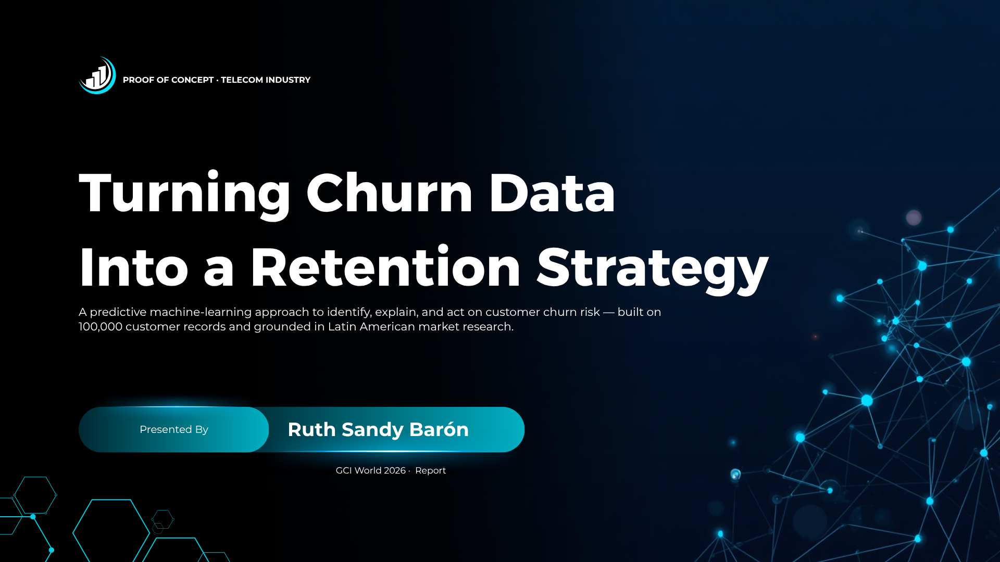
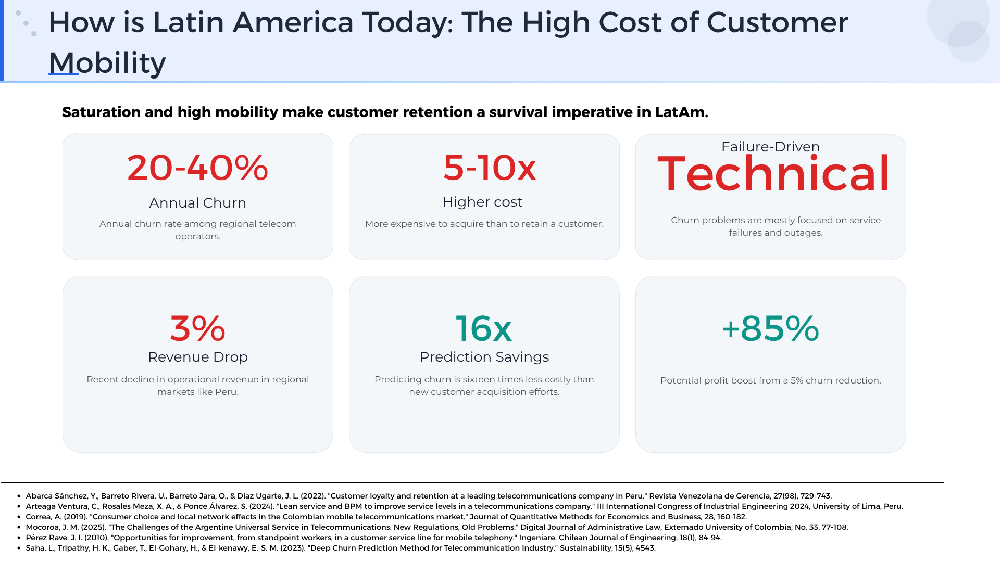
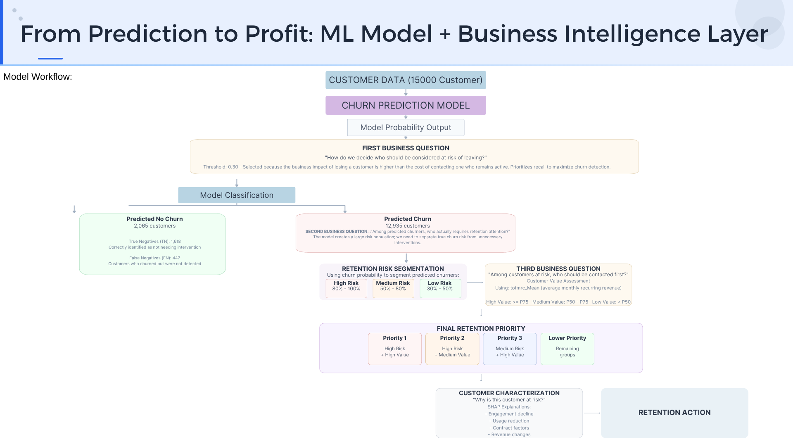
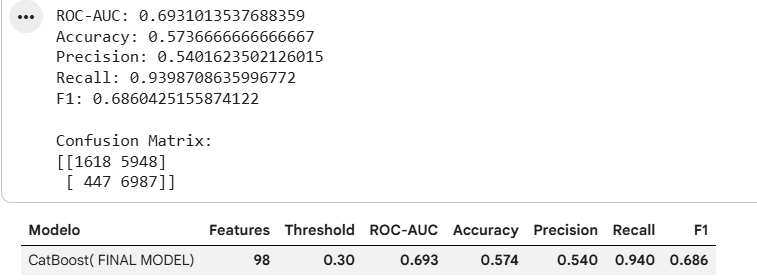
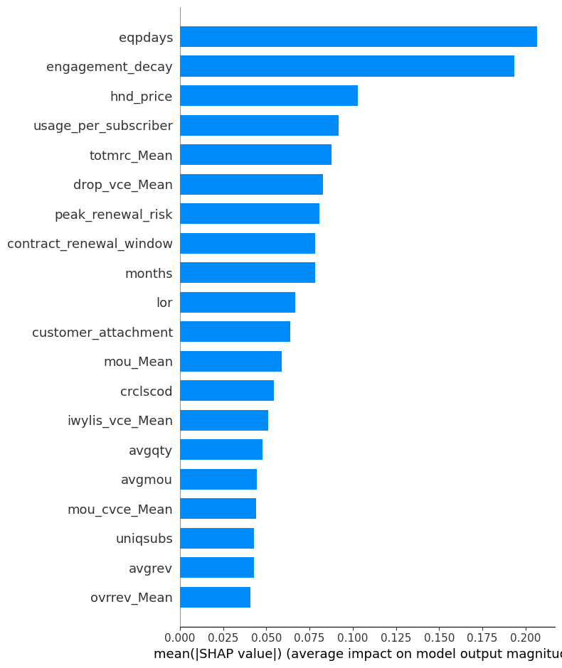
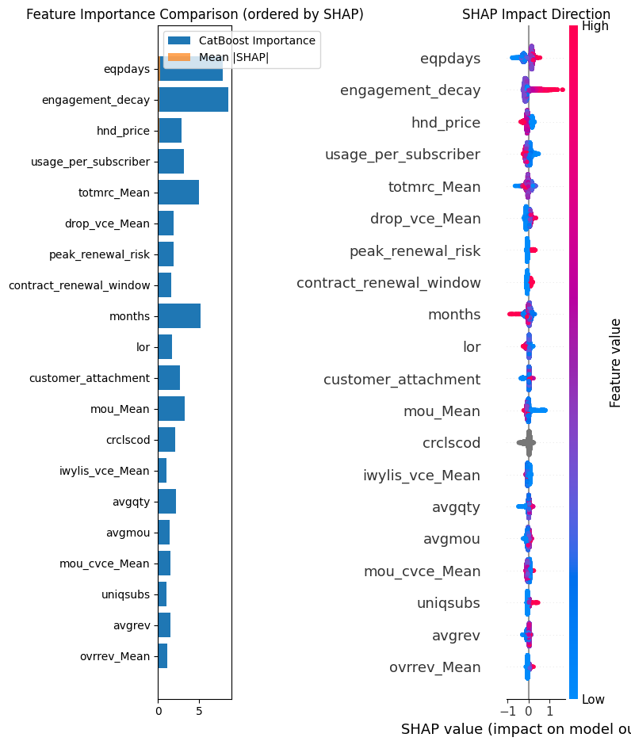
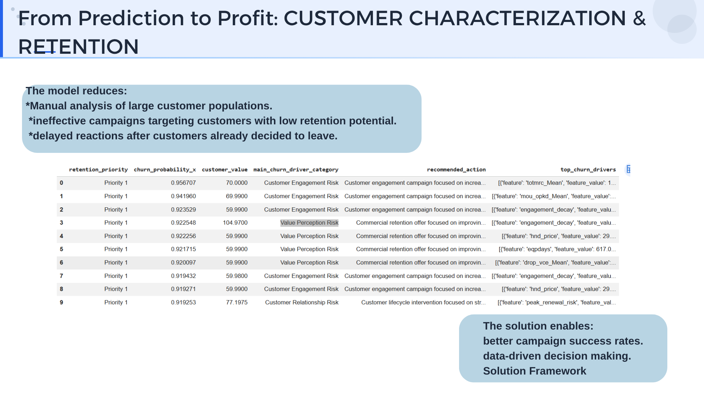

# 📡 Telecom Churn Intelligence

<p align="center">
  
</p>

<h3 align="center">
Predicting, Explaining and Prioritizing Customer Retention Using Machine Learning
</h3>

<p align="center">


</p>

---

# Table of Contents

* [Overview](#overview)
* [Business Context](#business-context)
* [Business Problem](#business-problem)
* [Dataset](#dataset)
* [Repository Structure](#repository-structure)
* [Project Workflow](#project-workflow)
* [Research Methodology](#research-methodology)
* [Feature Engineering](#feature-engineering)
* [Machine Learning Model](#machine-learning-model)
* [Model Performance](#model-performance)
* [Explainable AI (SHAP)](#explainable-ai-shap)
* [Business Intelligence Layer](#business-intelligence-layer)
* [Key Insights](#key-insights)
* [Business Impact](#business-impact)
* [Future Improvements](#future-improvements)
* [Author](#author)

---

# Overview

Customer churn is one of the most critical challenges in the telecommunications industry.

While many machine learning projects focus exclusively on predicting whether a customer will churn, this project extends the analysis by transforming model predictions into actionable business decisions.

The proposed framework combines predictive modeling, explainable AI, customer segmentation and business rules to support data-driven customer retention strategies.

Rather than answering only:

> **Who is likely to churn?**

this project also addresses:

* Why is the customer at risk?
* Which customers should be prioritized?
* How can retention resources be allocated more effectively?

---

# Business Context

Retaining existing customers is considerably more cost-effective than acquiring new ones, making churn prediction a strategic capability for telecommunications companies.

Using a telecommunications dataset containing approximately **100,000 customers**, this project develops a predictive solution capable of identifying customers at risk before cancellation occurs while providing interpretable explanations and business recommendations.

---

# Business Problem

<p align="center">

</p>

Most organizations identify churn only after customers have already decided to leave.

The objective of this project is to support proactive customer retention by combining predictive analytics with business intelligence, enabling organizations to identify high-risk customers, understand the factors influencing churn and prioritize retention efforts.

---

# Dataset

The repository includes the dataset as a compressed file.

```text
data.zip
```

After extraction, the dataset contains:

```text
Client.csv
Record.csv
```

### Client.csv

Contains customer-related information such as:

* Demographics
* Subscription details
* Billing information
* Service plans
* Device characteristics

### Record.csv

Contains behavioral and operational information including:

* Voice and data usage
* Customer activity
* Technical quality indicators
* Monthly service records
* Churn label

The notebook performs all preprocessing steps, including dataset merging, data cleaning, missing value handling and feature engineering.

---

# Repository Structure

```text
.
├── README.md
├── Telecom_Churn_Intelligence.ipynb
├── Telecom_Churn_Presentation.pdf
├── data.zip
│
└── Figures/
    ├── banner.png
    ├── business_problem.png
    ├── workflow.png
    ├── roc_curve.png
    ├── feature_importance.png
    ├── shap_summary.png
    └── solution_frameworks.png
```

---

# Project Workflow

<p align="center">

</p>

The project follows a structured data science methodology:

1. Business Understanding
2. Literature Review
3. Exploratory Data Analysis
4. Hypothesis Validation
5. Feature Engineering
6. Model Development
7. Hyperparameter Optimization
8. Threshold Optimization
9. Explainable AI (SHAP)
10. Business Decision Support

---

# Research Methodology

Instead of immediately training a machine learning model, the project began with an extensive business understanding phase supported by academic literature.

The exploratory analysis evaluated several hypotheses related to customer churn, including:

* Technical reliability
* Customer engagement
* Device lifecycle
* Behavioral trends

The findings showed that behavioral patterns were stronger churn predictors than isolated technical failures.

---

# Feature Engineering

Several interaction features were developed to better capture customer behavior.

Examples include:

* Engagement Decay
* Customer Attachment
* Revenue Evolution
* Technical Experience
* Device Lifecycle

These engineered variables became some of the most influential predictors according to SHAP analysis.

---

# Machine Learning Model

Two Gradient Boosting algorithms were evaluated:

* CatBoost
* XGBoost

CatBoost was selected due to its strong performance, native handling of categorical variables and compatibility with SHAP explainability.

Hyperparameters were optimized using Randomized Search, while the classification threshold was selected to maximize business value rather than traditional accuracy metrics.

---

# Model Performance

<p align="center">

</p>

<p align="center">

</p>
Base Model:

| Metric    | Value |
| --------- | ----: |
| ROC-AUC   | 0.693 |
| Recall    |  0.94 |
| Precision |  0.54 |

The optimized model prioritizes **Recall**, reducing the probability of missing customers who are likely to churn and supporting proactive retention strategies.

---

# Explainable AI (SHAP)

<p align="center">

</p>

To improve transparency, SHAP values were used to explain both global feature importance and individual customer predictions.

This explainability layer enables business stakeholders to understand the primary factors driving churn risk instead of relying solely on probability scores.

---

# Business Intelligence Layer

<p align="center">

</p>

The predictive model is complemented by a business decision framework that transforms churn probabilities into actionable retention strategies.

The framework combines:

* Churn probability
* Customer risk segmentation
* Customer value assessment
* Priority classification
* Explainable AI
* Recommended retention actions

This approach bridges the gap between predictive analytics and operational decision-making.

---

# Key Insights

* Customer engagement is a stronger predictor of churn than isolated technical failures.
* Feature engineering significantly enhanced predictive performance.
* Optimizing the decision threshold generated greater business value than maximizing overall accuracy.
* Explainable AI increases trust and transparency by revealing the main drivers behind each prediction.
* Combining machine learning with business rules creates a more practical decision-support framework.

---

# Business Impact

This project demonstrates how machine learning can support strategic customer retention by:

* Identifying customers at risk before churn occurs.
* Explaining the reasons behind each prediction.
* Prioritizing retention campaigns based on business value.
* Supporting data-driven CRM decision-making.
* Transforming predictive models into actionable business intelligence.

---

# Future Improvements

Potential future extensions include:

* Time-series customer behavior modeling.
* Survival analysis for churn prediction.
* Interactive Streamlit dashboard.
* Automated CRM reporting.
* AI-powered retention recommendation assistant.

---

# Author

**Ruth Sandy Barón**

Petroleum Engineer | Applied Artificial Intelligence & Machine Learning

Interested in Intelligent Systems, Natural Language Processing, Large Language Models and AI-driven Decision Support.
